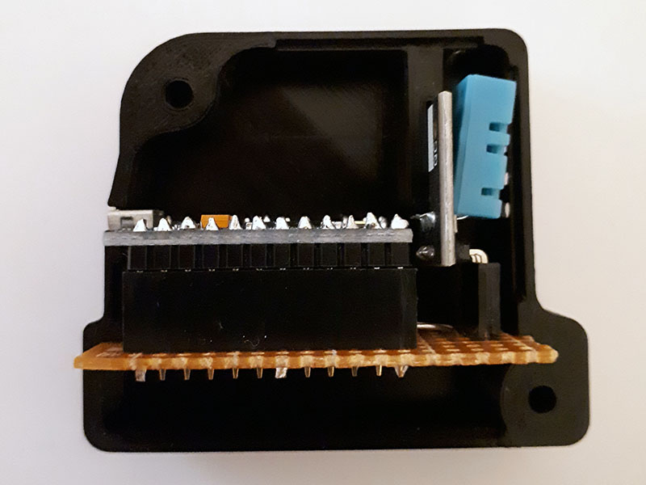

thlog
=====

Temperature and humidity logger.  

Features
========

Simple device and client software to obtain the temperature and relative humidity.  
Only Windows XP and newer is supported (Unicode enabled).  
Also Linux is supported.  

Usage
=====

    thlog [options] <device>
    
    -f, --format <string>
          Defines the output format string. The allows the same as strftime in C
          and the following:
          %vC - temperature in degrees Celsius
          %vF - temperature in degrees Fahrenheit
          %vH - relative humidity in percent
          The format modifiers of printf's %f can be applied here.
          The default is "%Y-%m-%d %H:%M:%S\t%.1vC\t%.1vH\n"
    -h, --help
          Print short usage instruction.
    -i, --interval <number>
          Update interval in seconds. Default: 10
        --license
          Displays the licenses for this program.
        --utf8
          Sets the encoding for error console and log file to UTF-8.
          The default is UTF-16.
    -u
          Display time in UTC instead of local time.
    -v
          Increases verbosity.
        --version
          Outputs the program version.

Example
=======

One output every 30 minutes with the data from the device connected to COM1:

    thlog -i 1800 COM1

Building
========

Compile and flush the device [firmware](src/arduino/arduino.ino) with the Arduino IDE to your device.  
You may want to change the calibration values for temperature and relative humidity [there](src/arduino/arduino.ino).  
For the client application the following dependencies are given:  
- C99

Edit Makefile to match your target system configuration.  
Building the program:  

    make

    

Files
=====

|Name            |Meaning
|----------------|--------------------------------------------------
|**src/arduino/**|**Arduino device firmware for thlog.**
|arduino.ino     |Main implementation of the device functionality.
|DHT11.hpp       |DHT11 protocol implementation.
|Meta.hpp        |C++11 meta programming helpers (derived from STL).
|                |
|**src/utility/**|**Utility functions.**
|argp*, getopt*  |Command-line parser.
|cvutf8.*        |UTF-8 conversion functions.
|mingw-unicode.h |Unicode enabled main() for MinGW targets.
|serial.*        |Serial interface functions.
|target.h        |Target specific functions and macros.
|tchar.*         |Functions to simplify ASCII/Unicode support.
|                |
|**src/**        |**Client application implementation.**
|license.i       |thlog license text include.
|parse.*         |Used LL(1) parser implementations.
|thlog.c         |Main application file.
|version.*       |Program version information.

License
=======

See [copying file](doc/COPYING).  

Contributions
=============

No content contributions are accepted. Please file a bug report or feature request instead.  
This decision was made in consideration of the used license.
